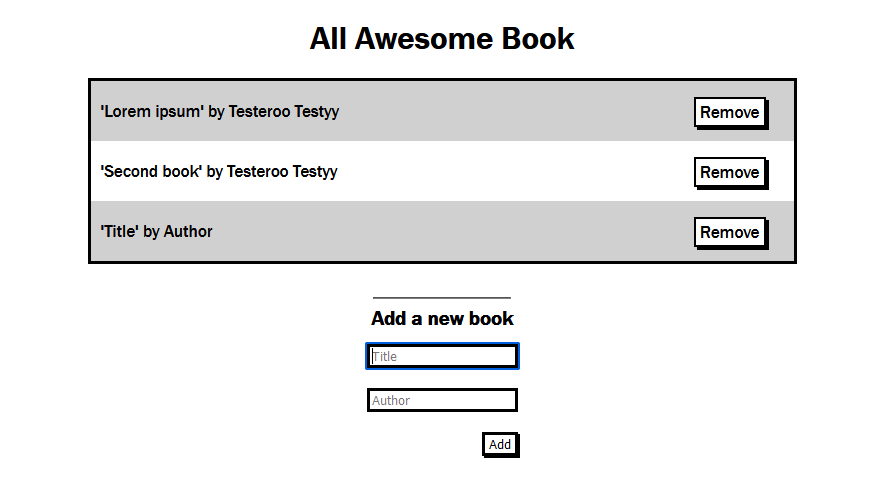

# Awesome-books

> This is a pair programming project that allows users to add and remove books from a list using javascript objects and arrays

Our goal here is to Build a book application with add and remove feature from scratch using JavaScripts. click [here](https://abenezer-tilahun.github.io/Awesome-books/) to see deployed live version





# Features implemented so far are:

- Responsive HTML page
- Add book feature
- Remove book feature
- Saving current state of book list to local storage

# Built With

- Lighthouse (An open-source, automated tool for improving the quality of web pages. It has audits for performance, accessibility, progressive web apps, SEO and more).
- Webhint (A customizable linting tool that helps you improve your site's accessibility, speed, cross-browser compatibility, and more by checking your code for best practices and common errors).
- Stylelint (A mighty, modern linter that helps you avoid errors and enforce conventions in your styles).
- ESlint (A mighty, modern linter that helps you avoid errors and enforce conventions in JavaScript codes)

To get a local copy up and running follow these simple example steps.

# Prerequisites

The basic requirements for building the executable are:

-  A working browser application (Google chrome, Mozilla Fire fox, Microsoft edge ...)
- VSCode or any other equivalent code editor.
- Node Package Manager (For installing packages like Lighthous, webhint & stylelint used for checking for debugging bad codes before deployment).

# Getting Started

#### Cloning the project
```
git clone  https://github.com/Abenezer-Tilahun/Awesome-books.git<Your-Build-Directory>
```

## Getting packages and debuging with Stylelint
```
npm install --save-dev stylelint@13.x stylelint-scss@3.x stylelint-config-standard@21.x stylelint-csstree-validator@1.x
```
##### For validation detection using Stylelint Run
```
npx stylelint "**/*.{css,scss}"
```
##### from parent source directory

## Getting packages and debuging with ESlint
```
npm install npm install --save-dev eslint@7.x eslint-config-airbnb-base@14.x eslint-plugin-import@2.x babel-eslint@10.x
```
##### For validation detection using Stylelint Run
```
npx eslint .
```
##### from parent source directory

## Getting packages and debuging with Webhint
```
npm init -y
npm install --save-dev hint@6.x
```
##### For validation detection using Webhint Run
```
npx hint .
```

 ## 🤝 Contributing

Feel free to check the [issues page](../../issues/).

## Authors

👤 **Author1**

- GitHub: [@githubhandle](https://github.com/Abenezer-Tilahun)
- Twitter: [@twitterhandle](https://twitter.com/AbenezerTilah11)
- LinkedIn: [LinkedIn](linkedin.com/in/abenezer-tilahun/)

👤 **Author2**

- - GitHub: [@githubhandle](https://github.com/usorfaitheloho)

## Show your support

Give a ⭐️ if you like this project!

## Acknowledgments

- Microverse
- My coding partners(@usorfaitheloho ))

## 📝 License

This project is [MIT](./MIT.md) licensed.

